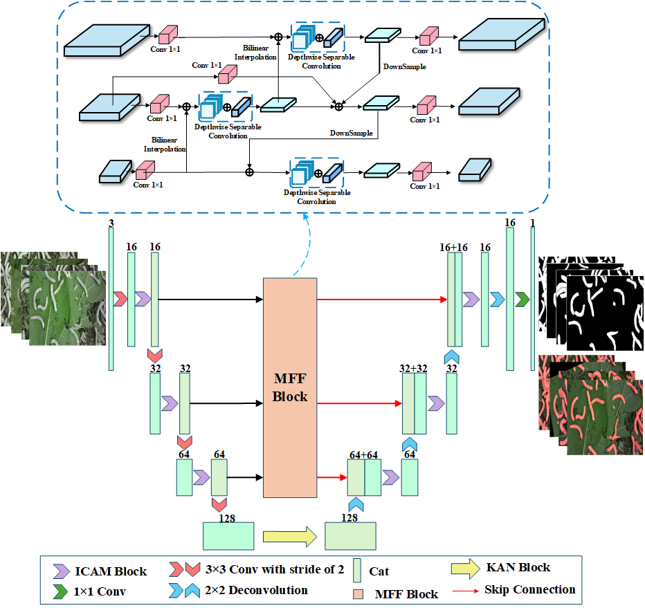

# SilkwormSeg
This project aims to obtain the silkworm contour and its distribution density through semantic segmentation technology, thereby promoting the development of intelligent silkworm-rearing techniques.

[[Paper]](https://doi.org/10.1016/j.atech.2025.101274)

# Abstruct

In the agricultural domain, image segmentation techniques based on deep learning have demonstrated significant potential for application. However, challenges related to data integrity, computing resources sufficiency, and deep learning models deploying. This study aims to acquire silkworm contours and their distribution density through image segmentation techniques to promote the development of intelligent silkworm breeding technologies. An improved U-Net network architecture is proposed for the specific task of silkworm image segmentation, addressing insufficient computing resources for silkworm breeding environment and the high memory, hardware requirements and large number of parameters for deploying deep learning models. The architecture integrates the Inverted Convolution Attention Mechanism Block (ICAM Block) and Kolmogorov-Arnold Network Block (KAN Block), enhancing the extraction of silkworm morphological features. Additionally, the designed Multiscale Feature Fusion Block (MFF Block) effectively utilizes low level features of silkworm images and models long range dependencies. Furthermore, by combining depthwise separable convolution and structural re-parameterization techniques, an optimized balance between segmentation accuracy and computational efficiency is achieved. Experimental results show that the improved model achieved an Intersection over Union (IoU) of 80.74 % and a Dice similarity coefficient (Dice) of 88.96 %, with an inference time of only 5.93 ms per image. Compared with the U-Net model, the computational complexity is reduced by 84.25 % (0.855 GFLOPs vs. 5.427 GFLOPs), and the number of parameters is reduced by 95.32 % (0.67 M vs. 14.33 M).

